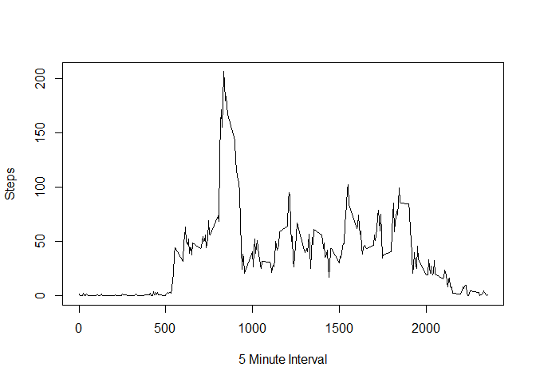
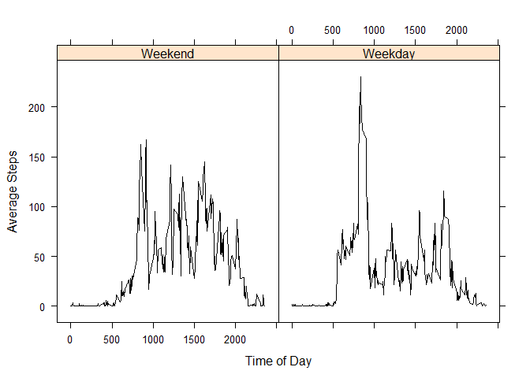

# Reproducible Research: Peer Assignment 1
Greg Nicholson  
Friday, February 19, 2016  

Step 1: Load packages (I used dplyr, ggplot2, and lattice for this assignment)
========================

```r
library(dplyr)
```

```
## Warning: package 'dplyr' was built under R version 3.2.1
```

```
## 
## Attaching package: 'dplyr'
```

```
## The following objects are masked from 'package:stats':
## 
##     filter, lag
```

```
## The following objects are masked from 'package:base':
## 
##     intersect, setdiff, setequal, union
```

```r
library(ggplot2)
```

```
## Warning: package 'ggplot2' was built under R version 3.2.1
```

```r
library(lattice)
```

Step 2:  Load and Preprocess the data.
========================
     Note, the data being analyzed contains Activity Monitoring Data and was extracted on 2/17/2016. 


```r
ACTIVITY_TABLE <- read.csv("activity.csv")
ACTIVITY_TABLE$date <- as.Date(ACTIVITY_TABLE$date)
```

Step 3:  What is mean total number of steps taken per day?
========================

3A - steps per day

```r
by_day <- group_by(ACTIVITY_TABLE, date)
steps_by_day <- summarise(by_day, steps=sum(steps))
```
3B - histogram

```r
qplot(steps_by_day$steps, geom="histogram",binwidth = 2500,main="Histogram of Daily Step Count",xlab = "Daily Steps",fill=I("blue"),col=I("black")) 
```


3C - mean and median

```r
mean_by_day <- summarise(steps_by_day, steps=mean(steps,na.rm=TRUE))
median_by_day <- summarise(steps_by_day,steps=median(steps,na.rm=TRUE))
head(mean_by_day)
```

```
## Source: local data frame [1 x 1]
## 
##      steps
## 1 10766.19
```

```r
head(median_by_day)
```

```
## Source: local data frame [1 x 1]
## 
##   steps
## 1 10765
```

Step 4:  What is the average daily activity pattern?
======================

4A - steps by 5 minute interval

```r
by_interval <- group_by(ACTIVITY_TABLE,interval)
mean_by_interval <- summarise(by_interval,steps=mean(steps,na.rm=TRUE))
plot(mean_by_interval$interval,mean_by_interval$steps,type="l",col="black",xlab="5 Minute Interval",ylab="Steps")
```


4B - which interval has the most steps

```r
max(mean_by_interval, na.rm=TRUE)
```

```
## [1] 2355
```

Step 5:  Imputting missing values
======================

Calculate the total number of "NA"


```r
sum(is.na(ACTIVITY_TABLE$steps))
```

```
## [1] 2304
```

My strategy for the NA's is to replace a NA with that interval's average over the life of the dataset.

```r
mean_by_interval_for_NA <- summarise(by_interval,avgsteps=mean(steps,na.rm=TRUE))
ACTIVITY_TABLE_TEMP <- merge(ACTIVITY_TABLE,mean_by_interval_for_NA,by="interval")

ACTIVITY_TABLE_CLEANSED <- within(ACTIVITY_TABLE_TEMP,
             steps <- ifelse(!is.na(steps),steps,avgsteps)
)
```

Make Histogram of steps


```r
by_day_C <- group_by(ACTIVITY_TABLE_CLEANSED, date)
steps_by_day_C <- summarise(by_day_C, steps=sum(steps))
qplot(steps_by_day_C$steps, geom="histogram",binwidth = 2500,main="Histogram of Daily Step Count - Cleansed Data",xlab = "Daily Steps",fill=I("blue"),col=I("black")) 
```


```r
mean_by_day_C <- summarise(steps_by_day_C, steps=mean(steps,na.rm=TRUE))
median_by_day_C <- summarise(steps_by_day_C,steps=median(steps,na.rm=TRUE))
head(mean_by_day_C)
```

```
## Source: local data frame [1 x 1]
## 
##      steps
## 1 10766.19
```

```r
head(median_by_day_C)
```

```
## Source: local data frame [1 x 1]
## 
##      steps
## 1 10766.19
```

Step 6:  Are there differences in activity patterns between weekdays and weekends?
===============================


```r
ACTIVITY_TABLE_CLEANSED$day <- weekdays(as.Date(ACTIVITY_TABLE_CLEANSED$date))
ACTIVITY_TABLE_CLEANSED$weekday <- factor((ACTIVITY_TABLE_CLEANSED$day %in% c('Monday', 'Tuesday', 'Wednesday', 'Thursday', 'Friday')),levels = c(FALSE,TRUE), labels = c('Weekend','Weekday'))

ACTIVITY_TABLE_CLEANSED_WD_SUM <- aggregate(x=ACTIVITY_TABLE_CLEANSED$steps, by=list(interval=ACTIVITY_TABLE_CLEANSED$interval,weekday=ACTIVITY_TABLE_CLEANSED$weekday), FUN = mean, na.rm = TRUE)

xyplot(ACTIVITY_TABLE_CLEANSED_WD_SUM$x ~ ACTIVITY_TABLE_CLEANSED_WD_SUM$interval | ACTIVITY_TABLE_CLEANSED_WD_SUM$weekday,
       data = ACTIVITY_TABLE_CLEANSED_WD_SUM,
       type = "l",
       lty = c(1, 2, 2, 1),
       lwd = c(1, 1, 1, 3),
       col.line = c(rep("black",3), "red"),
       xlab = "Time of Day",
       ylab = "Average Steps")
```


